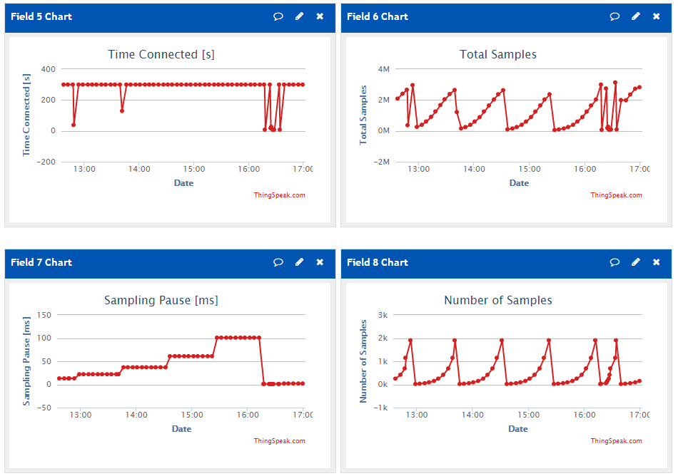
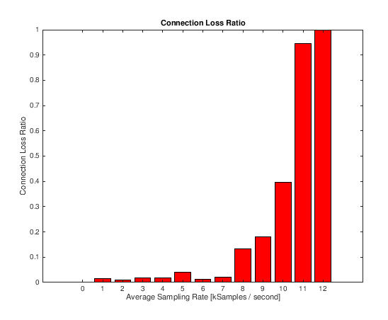
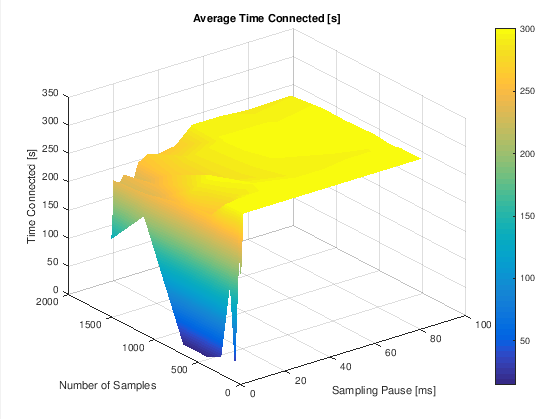
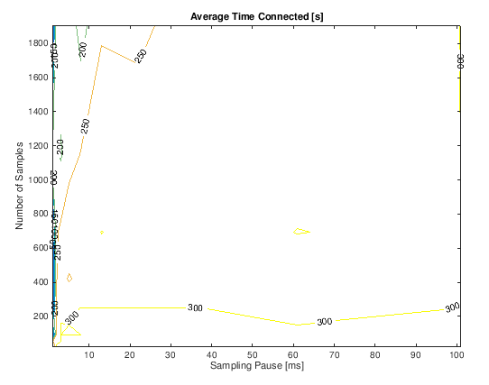
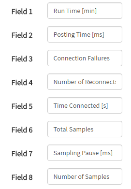

## Bravo

This application is sampling analog input A0 of ESP8266 to test how it affects Wi-Fi connection. According to issue report [#1634](https://github.com/esp8266/Arduino/issues/1634), continuous sampling of analog input causes Wi-Fi to disconnect. The test results are saved to ThingSpeak and displayed [on charts](https://thingspeak.com/channels/153983) for more convenient analysis.

Features:

* Sampling of A0 at maximum speed with periodic pauses
* Number of samples and pause are changed in a loop by the application
* Monitoring of Wi-Fi connection status
* Saving of test parameters and results to ThingSpeak


## Table of Contents

* [Introduction](#introduction)
* [Functionality](#functionality)
  * [Parameter Setting](#parameter-setting)
  * [Test Duration](#test-duration)
  * [Data Logging](#data-logging)
  * [Data Visualization](#data-visualization)
    * [Connection Loss Ratio](#connection-loss-ratio)
    * [Average Time Connected - Surface](#average-time-connected---surface)
    * [Average Time Connected - Contour](#average-time-connected---contour)
* [Installation](#installation)
* [Usage](#usage)
* [Results](#results)
* [Compatibility](#compatibility)
  * [Hardware](#hardware)
  * [Arduino Core](#arduino-core)
  * [Programming IDEs](#programming-ides)
* [Conclusion](#conclusion)


## Introduction

In previous section [Alfa](../Alfa) I have presented a sketch [EspScopeA0-Alfa.ino](../Alfa/EspScopeA0-Alfa/EspScopeA0-Alfa.ino) that is sampling analog input A0 of ESP8266. With this sketch you are able to collect specific number of A0 samples, make a pause and sample again. All in continuous infinite loop, with possibility to adjust the number of samples and the sampling pause on the fly. 

If sampling is done too often, then Wi-Fi connection is lost. This happens because we are competing for access to internal ADC with ESP's routines responsible for Wi-Fi management. The same ADC is used by ESP to calibrate Wi-Fi modem. [Espressif ESP8266 FAQs](https://espressif.com/sites/default/files/documentation/esp8266_faq_en.pdf) document dated on 2016.08, provides us with related recommendations on ADC usage. On page 18/32 it specifies that with "Wi-Fi modem normally active" you may sample ADC at 1k samples/sec.

Let's check if 1k samples/sec is the absolute maximum, or we can increase sampling rate and still have Wi-Fi operational. We can do it by stepping through the two the parameters - the number of samples and the sampling pause.

After doing coupe of tests with [EspScopeA0-Alfa.ino](../Alfa/EspScopeA0-Alfa/EspScopeA0-Alfa.ino) I realized that doing such check is time consuming. Wi-Fi connection may get lost after pretty random period for the same parameter values. Instead of tediously adjusting the values and observing Wi-Fi status, I decided to make all the work by the sketch. This section explains how it has been done.


## Functionality

Application has been prepared by copying [EspScopeA0-Alfa.ino](../Alfa/EspScopeA0-Alfa/EspScopeA0-Alfa.ino) and introducing the following changes:

  1. Procedure of checking for user input `checkUserInput()` has been removed
  2. Instead, sampling parameters are changed by function `nextSettings()`
  3. Parameter change is executed by updated function `isWiFiAlive(void)` on each connection loss or test period expiration
  4. New function `logToThingSpeak()` has been added to log the data in the cloud for visualization and analysis

Original application is described in section [Alfa](../Alfa). More details on particular changes are discussed below. 


### Parameter Setting

The number of samples and the sampling pause are changed programmatically by calling a simple function:

```
void nextSettings(void)
{
  numberOfSamples = numberOfSamples * 1.66 + 0.5;
  if (numberOfSamples > NUMBER_OF_SAMPLES)
  {
    numberOfSamples = 20;
    samplingPause = samplingPause * 1.66 + 0.5;
    if (samplingPause > 110)
    {
      samplingPause = 1;
    }
  }
}
```

On each subsequent call parameter is increased by 2/3 (1.66 multiplier) of its original value. Parameters are changed within predefined minimum and maximum boundaries. For instance, if sampling pause is reaching the maximum, it is reset back to minimum and the number of samples is stepped up by 2/3. If the number of samples reaches maximum, then it is reset back to minimum as well, and so on.

The following table provides the complete range of values generated by this function:

| Parameter Name | 1 | 2 | 3 | 4 | 5 | 6 | 7 | 8 | 9 | 10 |
| --- |:---:|:---:|:---:|:---:|:---:|:---:|:---:|:---:|:---:|:---:|
| Sampling Pause [ms] | 1 | 2 | 3 | 5 | 8 | 13 | 22 | 37 | 61 | 101 |
| Number of Samples | 20 | 33 | 55 | 91 | 151 | 251 | 417 | 692 | 1149 | 1907 |


### Test Duration

Application attempts to sample A0 for each pair of parameter settings above for the fixed period of 300s (5 minutes). If within this period connection is lost, then application starts over with next pair of settings.

The test period of 300 seconds is an arbitrary value. You can select other period. I would make it longer rather than shorter.

Looping through all the settings takes almost 8 hours. I left the application running for several days to take average results. This is to account for Wi-Fi connection loss that may be caused by factors other than A0 sampling, e.g. Wi-Fi access point reset.


### Data Logging

The following settings and test results are saved to [ThingSpeak](https://thingspeak.com/) for further analysis:

| ThingSpeak Field | ThingSpeak Name | Sketch Variable or Function Name | Description |
| --- | --- | --- | --- |
| Field 1 | Run Time [min] | `dataLogTimer / 60000` | Total time in minutes since last reset or power up of module |
| Field 2 | Posting Time [ms] | `postingTime` | Time in milliseconds that took to transmit the data and obtain a reply from ThingSpeak in previous post request |
| Field 3 | Connection Failures | `connectionFailures` | Number of times module failed to connect to ThingSpeak |
| Field 4 | Number of Reconnects | `numberOfReconnects` | Number of Wi-Fi reconnects |
| Field 5 | Time Connected [s] | `timeConnected` | Time in seconds during test duration that module was connected to Wi-Fi |
| Field 6 | Total Samples | `totalSamples` | Total number of A0 samples collected by module since last reset or power up |
| Field 7 | Sampling Pause [ms] | `samplingPause` | Pause in milliseconds after each continuous sampling of A0 |
| Field 8 | Number of Samples | `numberOfSamples` | Number of samples taken during continuous sampling of A0 |


### Data Visualization

[ThingSpeak](https://thingspeak.com/) provides charts to visualize saved parameters out of box. 



By configuring these charts, you can change the period of displayed data. You can also select data averaging / filtering. Such changes are done by clicking edit icon in the right upper corner of the chart window and entering new parameters.

If you need more advanced data processing, then use "MATLAB Visualization". ThingSpeak provides for free the potential of [MATLAB](https://www.mathworks.com/products/matlab/) to process your data and [plot](http://www.mathworks.com/products/matlab/plot-gallery.html) them in almost any form in a web browser. With this functionality I have prepared the following three charts to show test results live / on line.

The code to process input data and show the charts is saved in [matlab](matlab) folder of Bravo repository.

For live charts see https://thingspeak.com/channels/153983. Charts discussed below show data collected continuously for specific period from September 11th till 27th, 2016.


#### Connection Loss Ratio

The primary purpose of this application is to establish maximum sampling rate of A0 that is not causing Wi-Fi to disconnect. This can be checked on a chart below. The sampling rate has been calculated by dividing the total number of samples during single test ([Field 6](#data-logging)) by the time Wi-Fi was connected ([Field 5](#data-logging)).



See [MATLAB code](matlab/connection-loss-ratio-300s.mlx)


#### Average Time Connected - Surface

Besides checking the maximum sampling rate, I am also interested what combination of number of samples and sampling pause are "safe" and not causing Wi-Fi to disconnect. If Wi-Fi disconnects, I would like to know how soon it happens (before reaching the test period of 300 seconds). To show function of two parameters I decided to use 3D surface plot.



See [MATLAB code](matlab/average-time-connected-surface-300s.mlx)

Deep blue color visualizes short connection time, i.e. when Wi-Fi disconnects shortly after starting the test. Reach yellow color shows successful completion of the test step, where Wi-Fi did not disconnect for the test period of 300 seconds. 


#### Average Time Connected - Contour

If 3D surface plot above looks too fancy or hard to read, then check simpler contour plot. It is using the same ranges of number of samples and sampling pause. However, instated of color surface it is showing contours of Wi-Fi connection time.



See [MATLAB code](matlab/average-time-connected-contour-300s.mlx)


## Installation

If you do not like to take results above for granted, then check them by yourself. All the code you need is in this repository. 

Open [EspScopeA0-Bravo.ino](EspScopeA0-Bravo/EspScopeA0-Bravo.ino) sketch and update SSID and password so ESP module can join your Wi-Fi network.

Log-in to your [ThingSpeak](https://thingspeak.com/) account and configure new channel's fields as shown below.



In the sketch, in the line below, replace `your-api-key-here` with channel's Read API Key:

```cpp
#define API_KEY "your-api-key-here"
```

To obtain the key (it looks like `U6GWWLQRMQYPTPII`) just copy it from the API Keys tab in your ThingSpeak channel.

Upload updated sketch to ESP module and open a serial monitor. Initially you should see a message like below:

```
....
EspScopeA0-Bravo 0.2.4
Connecting to sensor-net
........
Connected, IP address: 192.168.1.100
```

Wait for couple of minutes observing the log to see if application properly communicates with internet. Each time application uploads data to ThingSpeak the log will look as follows:

```
DATALOG > api.thingspeak.com > Sending > HTTP/1.1 200 OK
Content-Type: text/html; charset=utf-8
Content-Length: 4
Connection: close
Status: 200 OK
X-Frame-Options: ALLOWALL
Access-Control-Allow-Origin: *
Access-Control-Allow-Methods: GET, POST, PUT, OPTIONS, DELETE, PATCH
Access-Control-Allow-Headers: origin, content-type, X-Requested-With
Access-Control-Max-Age: 1800
ETag: "8612c55d2969d1f587bf1c5aaaa32964"
Cache-Control: max-age=0, private, must-revalidate
X-Request-Id: d64a6883-0190-4e2d-bc2d-6b96cb13a815
X-Runtime: 0.020691
X-Powered-By: Phusion Passenger 4.0.57
Date: Tue, 27 Sep 2016 19:18:40 GMT
Server: nginx/1.9.3 + Phusion Passenger 4.0.57

7342 > Done in 432 ms
```

If connection to Wi-Fi is lost, then application connects back and transmits data to ThingSpeak:

```
Not connected ............. now connected
DATALOG > api.thingspeak.com > Sending > HTTP/1.1 200 OK
Content-Type: text/html; charset=utf-8
Content-Length: 4
(...)
```

Once you make sure that data are properly sent to ThingSpeak, configure the charts. The code for "MATLAB Visualization" charts is available in the [matlab](matlab) folder.


## Usage

For initial low values of sampling pause, the Wi-Fi connection may get lost already after couple of seconds since start of A0 sampling. If this is the case, then application will wait with sending the data to ThingSpeak, so posting is done no often than once per minute. We do it not to exceed the maximum posting time to ThingSepak and still have some reserve. I believe the maximum posting time allowed by ThingSpeak is 15 seconds.

Make sure the module is posting the data correctly. Check if all the charts are configured and showing the values you can cross check on the serial monitor. Then place your module in some quiet place and let it run for couple of days posting the data to ThingSpeak. 


## Results

Checking the [Connection Loss Ratio](#connection-loss-ratio) chart, it is clearly visible that for average sampling rate of 8k samples / second and above, Wi-Fi connection is getting unstable. For instance, for 10k samples / s you have about 40% chances that connection will not be dropped within 300 seconds. To be on a safe side I would not exceed a half of average sampling when we see Wi-Fi becoming unstable, in this case 4k samples / s.

Looking on the [Average Time Connected - Contour](#average-time-connected---contour) chart you can check the other limiting factor that is the maximum number of samples taken in a single shoot. Please note that the number of samples shown in [Field 8](#data-logging) is taken in a single shoot without any delays, then the pause is made ([Field 7](#data-logging)). Therefore, basing on this test, if you do not like your Wi-Fi connection to drop, then you should not exceed 200 samples taken in a single shoot. 

Third issue to consider when "overclocking" the A0 sampling is in which direction Wi-Fi communication is done. During this test Wi-Fi communication was done the one way only - to the ThingSpeak. If your ESP is also expected to actively listen to and accept incoming messages, then you should further reduce the average sampling rate. I believe that a good starting point would be taking not half but 1/4 of the average sampling discussed in the first paragraph above, that is 2k samples / second.


## Compatibility

[EspScopeA0-Bravo](EspScopeA0-Bravo/EspScopeA0-Bravo.ino) has been successfully tested with the following h/w and s/w.


#### Hardware

* NodeMCU 1.0 (ESP-12E Module) @ 80MHz, 1MB SPIFFS


#### Arduino Core

* [Esp8266 / Arduino](https://github.com/esp8266/Arduino) core [2.3.0](https://github.com/esp8266/Arduino/releases/tag/2.3.0) for Arduino IDE and Visual Micro
* [framework-arduinoespressif](http://platformio.org/platforms/espressif) version 13 for PlatformIO


#### Programming IDEs

* [Arduino IDE](https://www.arduino.cc/en/Main/Software) 1.6.11 portable version running on Windows 7 x64
* [PlatformIO IDE](http://platformio.org/platformio-ide) 1.4.0 CLI 2.11.2 running on Windows 7 x64
* [Visual Micro](http://www.visualmicro.com/) 1606.17.10 with Visual Studio Community 2015 running on Windows 7 x64


## Conclusion

ESP8266 is a very popular, quite versatile and handy chip. Finding new application for this chip, people are constantly challenging its operation limits provided in [specification](https://espressif.com/sites/default/files/documentation/0a-esp8266ex_datasheet_en.pdf). A good example is extended [test of 5V tolerance of ESP](http://www.ba0sh1.com/2016/08/03/is-esp8266-io-really-5v-tolerant/) made by [Baoshi](https://twitter.com/ba0sh1).

I would not exceed limits provided in specification for a chip when building a consumer product. I threat this and other similar tests as a confirmation that ESP8266 is a good design having well thought margins in specification. This provides confidence that our product will perform reliably both under normal and non-conducive operating conditions.

