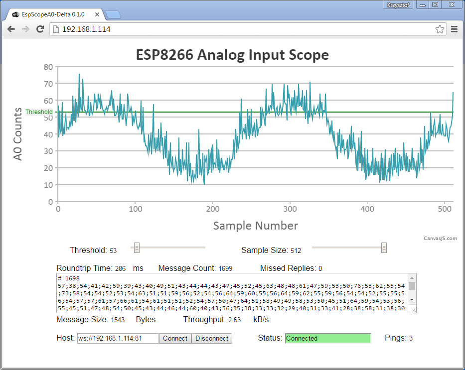
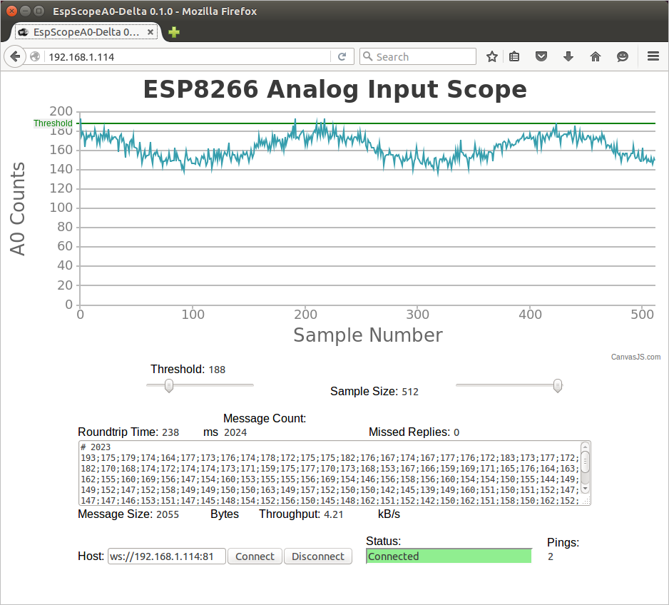

## Delta

This application is sampling analog input A0 of ESP8266, so it then can be displayed on-line in a web browser.

Features:

* Sampling of A0 at maximum speed
* Adjustable number of samples
* Adjustable sampling threshold
* Data transfer for visualization using WebSockets
* Use of ESP WebSever for visualization

[Sketch](EspScopeA0-Delta)


### Installation

1. Update ``` ssid ``` and ``` password ``` in [EspScopeA0-Delta.ino](EspScopeA0-Delta/EspScopeA0-Delta.ino) sketch so the module can join your Wi-Fi network.

2. Upload updated [EspScopeA0-Delta.ino](EspScopeA0-Delta/EspScopeA0-Delta.ino) sketch to your ESP module.

3. Then upload web HTML, CSS, JS, etc. that are saved in [data](EspScopeA0-Delta/data) folder following procedure specific for [Arduino IDE](https://github.com/esp8266/Arduino/blob/master/doc/filesystem.md#uploading-files-to-file-system), [PlatformIO CLI](http://docs.platformio.org/en/latest/platforms/espressif.html#uploading-files-to-file-system-spiffs), [PlatformIO IDE](http://www.esp8266.com/viewtopic.php?p=47825#p47825) or [Visual Micro](http://www.visualmicro.com/page/esp8266.aspx) (ref. SPIFFS File System).

4. After uploading, open serial terminal of your IDE to check if module joined your network. This will be confirmed by displaying specific IP address assigned to module by Wi-Fi router as shown below:

  ```
  EspScopeA0-Delta 0.1.0
  Connecting to SSID-of-Your-Network
  ........
  Connected, IP address: 192.168.1.114
  WebSockets started
  HTTP server started
  Open http://192.168.1.114/ to see the scope
  ```

5. Enter displayed IP address (mine was ``` 192.168.1.114 ```) in web browser and after couple of seconds you should see the scope screen:

  

The application in web browser served by ESP module starts automatically. It establishes web socket connection back to the module. Then requests A0 samples and immediately displays received data as wave-forms on the chart. Successful connection is visible on serial terminal of ESP as follows:

```
Open http://192.168.1.114/ to see the scope
[0] Connected from 192.168.1.101
[0] get Text: Hello from Browser :-) Tue Jul 12 2016 19:12:26 GMT+0200 (Central European Daylight Time)
[0] get Text: ping
```

In example below the PC with browser has IP address of ``` 192.168.1.101 ```. Every 60 seconds browser sends a ping to ESP visible in the log as ``` get Text: ping ```.

Using slider below the chart you can adjust threshold and number of samples. Changes should be immediately reflected on the screen. Transmission statistics and individual data received from ESP8266 are shown below the slides. Further down below there are buttons to connect / disconnect, connection status and number of pings sent to ESP.


### Test Summary

[EspScopeA0-Delta](EspScopeA0-Delta) has been successfully tested with the following h/w and s/w.

#### Hardware

* NodeMCU 1.0 (ESP-12E Module) @ 80 and 160MHz, 1MB SPIFFS

#### Arduino Core

* [Esp8266 / Arduino](https://github.com/esp8266/Arduino) core [2.3.0](https://github.com/esp8266/Arduino/releases/tag/2.3.0) for Arduino IDE and Visual Micro
* [framework-arduinoespressif](http://platformio.org/platforms/espressif) version 13 for PlatformIO

#### Libraries

* [arduinoWebSockets](https://github.com/Links2004/arduinoWebSockets) by [Links2004](https://github.com/Links2004), release [2.0.3](https://github.com/Links2004/arduinoWebSockets/releases/tag/2.0.3) for Arduino IDE and Visual Micro
* [Web Sockets (ID 549)](http://platformio.org/lib/show/549/WebSockets), version ab0d8ff526 for PlaformIO

#### Programming IDEs

* [Arduino IDE](https://www.arduino.cc/en/Main/Software) 1.6.9 portable version running on Windows 7 x64
* [PlatformIO IDE](http://platformio.org/platformio-ide) 1.3.0 CLI 2.11.0 running on Windows 7 x64
* [Visual Micro](http://www.visualmicro.com/) 1606.17.10 with Visual Studio Community 2015 running on Windows 7 x64
 
#### Web Browsers

* Internet Explorer 11.0 running on Windows 7 x64 
* Google Chrome Version 51.0.2704.106 m running on Windows 7 x64
* Firefox 44.0.2 running on Ubuntu 14.04 LTS
* Microsoft Edge 25.10586.0.0 running on Windows 10



