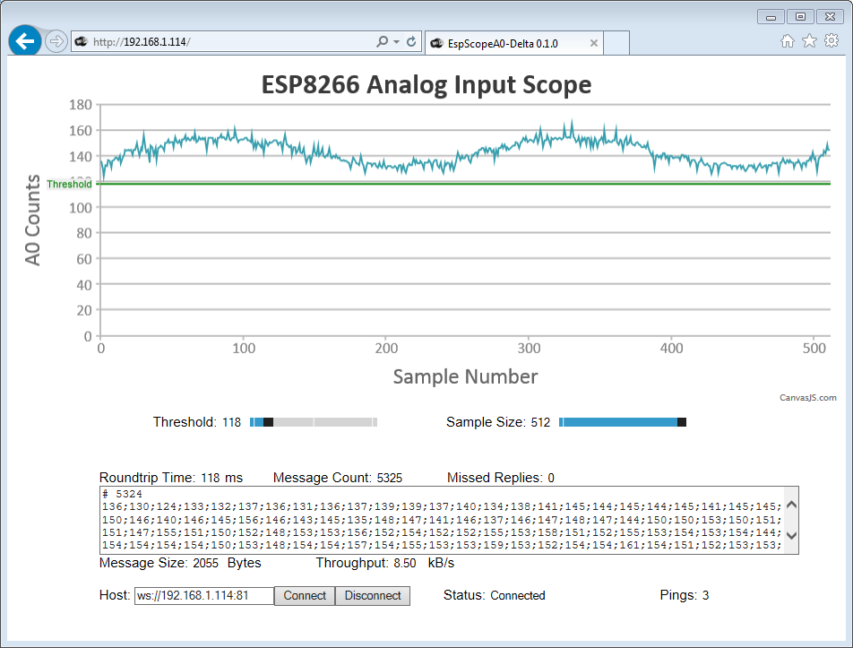

# EspScopeA0

This application is sampling analog input A0 of ESP8266, so it then can be displayed on-line in a web browser.

Ref: https://github.com/esp8266/Arduino/issues/1634#issuecomment-192366219

## Introduction

The repository provides seven versions of EspScopeA0 application. It is intended to walk you through development, starting from basic functionality, and ending in fully featured application optimized to display wave-forms in real-time in a web browser.

The following features are discussed and added step by step in each application version:
  1. State machine to handle data sampling
  2. Web server to visualize data on-line
  3. Web sockets to provide fast data transfer between ESP module and web browser
  4. Java Script charting library to use ready, proven and fast solution to display wave-forms
  5. Implementation of additional charts to visualize data transfer performance on-line
  6. OTA updates to make firmware updates quick and easier without serial interface
  7. Binary versus text data encoding to further speed up data transfer with web sockets

## Versions

I was thinking how to name each version to avoid boring numbers or letters. I liked to have them clearly identify themselves to immediately know which one is first, second, third and so on. Software versions (at least preliminary) are often called Alfa, Beta, etc. So here it comes [phonetic alphabet]( https://en.wikipedia.org/wiki/NATO_phonetic_alphabet). I hope it will not sound to militaristic to you :smile:. If this is the case, then stay tuned to my next project where I am planning to use some other variation of this naming convention. 

A brief description of each version is provided below.

### Alfa

Initial version of application providing basic functionality of sampling analog input with adjustable rate. It allows to check how sampling rate may affect Wi-Fi stability if connection.

[Description](Alfa) | [Sketch](Alfa/EspScopeA0-Alfa/EspScopeA0-Alfa.ino)

### Bravo

Originally I intended to name it Beta, but then decided to stick to phonetic alphabet, so here it goes Bravo. This is essentially Alfa version that automatically changes sampling rate at predefined steps. It monitors if Wi-Fi connection is not lost and saves results to [ThingSpeak](https://thingspeak.com/).

[Description](Bravo) | [Sketch](Bravo/EspScopeA0-Bravo/EspScopeA0-Bravo.ino)

### Charlie

This is extension of [Alfa](#alfa) that is displaying collected samples in a web browser. Data are transferred from ESP to browser using web sockets.

Description :construction: | [Sketch](Bravo/EspScopeA0-Bravo/EspScopeA0-Charlie.ino)

### Delta

In order to make it easier for the user, Delta is first self-contained application. All the web pages are served by ESP. In previous version the pages were separate, saved and opened directly from a PC.

[Description](Delta) | [Sketch](Delta/EspScopeA0-Delta/EspScopeA0-Delta.ino)

### Echo :construction:

This versions provides adjustable period between individual samples. So far sampling was done at maximum speed allowed by ESP hardware.

### Foxtrot :construction:

I was curious what are the factors affecting performance of EspScopeA0. For instance bigger number of samples will take longer time to transmit over Wi-Fi and process by the web browser. Also higher CPU speed of ESP8266 (you may select either 80 or 160MHz) may help to process all the data quicker. In order to measure performance I have introduced additional chart to show performance data in graphical format as opposed to numbers that may get boring.

### Golf :construction:

The last version is supposed to take advantage of binary data transfer by web sockets. Less data to transfer should improve performance. This version is also adding OTA functionality to provide firmware updates faster and in more convenient manner that using a serial port.

## Contribute

Feel free to contribute to the project in any way you like!
If you find any issues with code or descriptions please report them using *Issues* tab above.

## Credits

Software for this project has been prepared thanks to great work of the following teams and individuals:
* Arduino team that develops and maintains versatile [Arduino IDE](https://www.arduino.cc/)
* esp8266/Arduino team lead by [Ivan Grokhotkov](https://twitter.com/i_grr) that brought to us excellent [ESP8266 core for Arduino](https://github.com/esp8266/Arduino)
* [Links2004](https://twitter.com/links2004) who developed great and very reliable [arduinoWebSockets](https://github.com/Links2004/arduinoWebSockets).
* [CanvasJS](https://twitter.com/canvasjs), developer of amazing [HTML5 JavaScript Charts](http://canvasjs.com/)

## Build Status

## License

[GNU LESSER GENERAL PUBLIC LICENSE - Version 2.1, February 1999](LICENSE)
